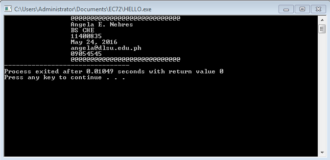

```
#include <stdio.h>
#include <stdlib.h>

/* run this program using the console pauser or add your own getch, system("pause") or input loop */

int main(int argc, char *argv[]) {
	printf("\t \t @@@@@@@@@@@@@@@@@@@@@@@@@@@@ \n");
	printf(" \t \t Angela E. Nebres \n \t \t BS CHE \n \t \t 11400835 \n \t \t May 24, 2016 \n \t \t angela@dlsu.edu.ph \n \t \t 09054545 \n");
		printf("\t \t @@@@@@@@@@@@@@@@@@@@@@@@@@@@");
	return 0;
}
```

